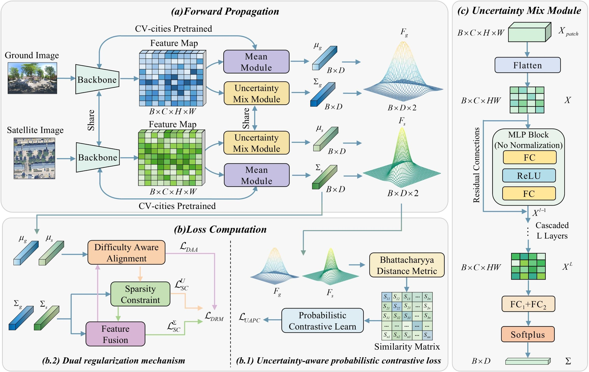
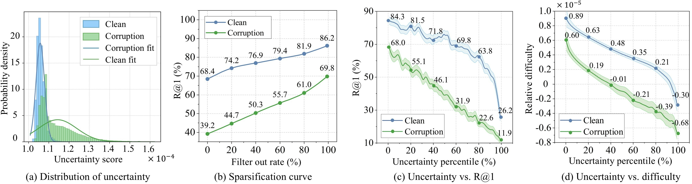

<div align="center">

🎯🌐🔍 Beyond Determinism: Regularized Probabilistic Features for Cross-View Geo-Localization

[](https://github.com/HobeFrank/RPF)

</div>

# Description 📜
--------------

Cross-view geo-localization (CVGL) aims to localize ground images using geotagged satellite imagery. Existing methods project images onto deterministic point features in a shared embedding space, which limits their ability to model real-world image uncertainty arising from factors such as sparse textures and noise. Consequently, the resulting features are often corrupted by unreliable information.

We propose the **Probabilistic CVGL (PCVGL)** paradigm, which extends cross-view representations from point features to probabilistic features for the first time. To instantiate this paradigm, we introduce the **Regularized Probabilistic Features (RPF)** framework. RPF incorporates:

* **Uncertainty Mix Module (UMM)**: Models uncertainty across feature dimensions via cascaded MLPs with residual connections.

* **Uncertainty-Aware Probabilistic Contrastive (UAPC) Loss**: Leverages Bhattacharyya distance to enable variance-driven adaptive feature alignment.

* **Dual Regularization Mechanism (DRM)**: Integrates localization difficulty and feature discriminability into variance learning, consisting of Difficulty-Aware Alignment (DAA) loss and Sparsity Constraint (SC) loss.

# Datasets 📊
We evaluate RPF on three widely used clean benchmarks, and further construct corruption benchmarks to simulate uncertain environments.

## Clean Benchmarks 🏞️

| Dataset | Type | #Pairs | Description |
|:-------:|:----:|:------:|:------------|
| **VIGOR** | Panorama ↔ Satellite | 105k / 90k | 4 US cities, cross-area & same-area modes |
| **CVACT** | Panorama ↔ Satellite | 35.5k / 8.9k | Suburban & rural regions of Canberra |
| **University-1652** | Drone ↔ Satellite | 1,652 buildings | 72 universities worldwide |

## Corruption Benchmarks 🔧

To evaluate robustness, we introduce corruptions (blur, noise, weather, digital) at multiple severity levels on VIGOR, CVACT, and University-1652, following the protocol of CVACT_val-C.

#Framework Architecture 🖇️

<div align="center">
  
  <br>
  <em>Overall framework of RPF. A dual-branch Siamese network encodes images as Gaussian distributions (μ, Σ). UMM extracts variance, UAPC loss uses Bhattacharyya distance, and DRM regularizes uncertainty with difficulty alignment.</em>
</div>

## Key Features ✨

### Probabilistic Feature Representation
- Maps each image to a Gaussian distribution: \( p(f|I) = \mathcal{N}(f; \mu, \text{diag}(\Sigma)) \)
- Mean μ captures semantic content, variance Σ models dimension-wise reliability

### Uncertainty Mix Module (UMM)
- Flattens patch features and performs multi-layer feature mixing
- Preserves amplitude information (no normalization) to retain scale cues for uncertainty
- Outputs non-negative variance via Softplus activation

### Uncertainty-Aware Probabilistic Contrastive Loss
- Uses Bhattacharyya distance (BD) to measure distribution overlap
- BD adaptively weights mean differences by inverse variance, suppressing unreliable dimensions
- Encourages variance structure consistency across cross-view pairs

### Dual Regularization Mechanism (DRM)
- **DAA Loss**: Aligns variance with localization difficulty (similarity gap between positive and hardest negative)
- **SC Loss**: Sparsity constraints on both variance and difficulty signal to prevent variance inflation and enhance feature separability

 # Performance Results 🚀

## Performance on Clean Benchmarks

### VIGOR Dataset (Cross-Area / Same-Area)

| Method | Cross-Area R@1 | Cross-Area R@5 | Cross-Area HI | Same-Area R@1 | Same-Area R@5 | Same-Area HI |
|:------:|:-------------:|:-------------:|:-------------:|:-------------:|:-------------:|:-------------:|
| Sample4Geo | 51.70% | 77.86% | 61.70% | 69.87% | 95.66% | 83.50% |
| FRGeo | 37.54% | 59.58% | 40.66% | 71.26% | 91.38% | 82.41% |
| CV-cities | 64.61% | 87.48% | 75.97% | 78.27% | 96.10% | 90.76% |
| **RPF (Ours)** | **68.84%** | **89.78%** | **80.15%** | **79.83%** | **97.14%** | **93.03%** |

### University-1652 Dataset

| Method | Satellite→Drone R@1 | Satellite→Drone AP | Drone→Satellite R@1 | Drone→Satellite AP |
|:------:|:------------------:|:------------------:|:-------------------:|:------------------:|
| CV-cities | 96.01% | 92.57% | 97.43% | 95.01% |
| CDM-Net | 96.68% | 94.05% | 95.13% | 96.04% |
| **RPF (Ours)** | **96.77%** | **95.93%** | **97.72%** | **95.93%** |

## Robustness on Corruption Benchmarks

### University‑1652_val‑C

| Mode | Method | Blur‑Gaussian | Weather‑Brightness | Noise‑Shot | Corruption Avg. |
|------|--------|---------------|--------------------|-------------|------------------|
| **Satellite → Drone** | Sample4Geo [39] | 84.17% / 10.47% | 90.14% / 4.12% | 86.21% / 8.30% | 86.84% / 7.63% |
| | CCR [37] | 78.84% / 17.39% | 91.26% / 4.38% | 86.78% / 9.07% | 85.63% / 10.28% |
| | CV‑cities [12] | 87.58% / 8.76% | 90.06% / 6.18% | 85.82% / 10.60% | 87.82% / 8.51% |
| | CV‑cities† [13] | 87.74% / 8.59% | 91.60% / 4.18% | 87.44% / 8.91% | 89.05% / 7.23% |
| | MEAN [38] | 79.17% / 16.92% | 91.14% / 4.36% | 86.45% / 9.28% | 85.59% / 10.19% |
| | **RPF (Ours)** | **90.33%** / **6.66%** | **93.04%** / **3.85%** | **88.95%** / **8.08%** | **90.77%** / **6.20%** |
| **Drone → Satellite** | Sample4Geo [39] | 66.97% / 27.67% | 86.96% / 6.09% | 77.94% / 15.83% | 77.29% / 16.53% |
| | CCR [37] | 54.80% / 40.94% | 88.41% / 4.71% | 77.93% / 16.01% | 73.71% / 20.55% |
| | CV‑cities [12] | 92.58% / 4.98% | 94.72% / 2.78% | 92.49% / 5.07% | 93.26% / 4.28% |
| | CV‑cities† [13] | 93.44% / 4.24% | 95.72% / 1.90% | 93.58% / 4.09% | 94.25% / 3.41% |
| | MEAN [38] | 60.31% / 35.01% | 87.58% / 5.62% | 78.06% / 15.88% | 75.32% / 18.84% |
| | **RPF (Ours)** | **95.24%** / **2.53%** | **96.39%** / **1.36%** | **93.96%** / **3.84%** | **95.20%** / **2.58%** |

 *Values are shown as **R@1↑ / RCE↓**. RCE = (R@1_clean – R@1_corrupt) / R@1_clean.*

### CVACT_val‑C

| Method | Blur‑Zoom | Weather‑Spatter | Noise‑Speckle | Digital‑Contrast | Corruption Avg. |
|--------|-----------|-----------------|---------------|-------------------|------------------|
| Sample4Geo [39] | 37.28% / 59.00% | 83.45% / 8.23% | 84.25% / 7.35% | 40.65% / 55.30% | 61.41% / 32.47% |
| AuxGeo [36] | 34.88% / 61.89% | 81.06% / 11.44% | 78.95% / 13.75% | 42.81% / 53.23% | 59.43% / 35.08% |
| FRGeo [1] | 49.59% / 45.11% | 83.93% / 7.11% | 86.08% / 4.73% | 53.55% / 40.73% | 68.29% / 24.42% |
| CV‑cities [12] | 69.44% / 25.00% | 88.09% / 4.86% | 87.85% / 5.12% | 89.16% / 3.71% | 83.64% / 9.67% |
| CV‑cities† [13] | 70.41% / 23.96% | 88.27% / 4.68% | 88.34% / 4.61% | 89.23% / 3.64% | 84.06% / 9.22% |
| **RPF (Ours)** | **72.03%** / **22.52%** | **89.18%** / **4.08%** | **88.77%** / **4.51%** | **90.09%** / **3.09%** | **85.02%** / **8.55%** |


## Understanding Uncertainty 🔍

We demonstrate that uncertainty in RPF is not merely noise but a meaningful indicator of localization difficulty:
- Higher uncertainty correlates with increased similarity between positive and hardest negative samples.
- Removing high-uncertainty samples substantially boosts R@1 (from 68.4% → 86.2% on clean data).
- Variance features suppress uncertain regions (e.g., roads) allowing mean features to focus on discriminative structures (e.g., buildings).

<div align="center">
  
  <br>
  <em>Left: Sparsification curve – removing high-uncertainty samples improves R@1. Right: Attention maps – variance suppresses uncertain regions (roads) while mean focuses on discriminative buildings.</em>
</div>

## Installation & Usage 🚂

### Requirements

```bash
pip install -r requirements.txt
```

### Training

```bash
cd rpf/train
python train_universitySD.py
```

## Acknowledgements 🙏

This work is supported by the Natural Science Foundation of China. We thank the authors of:
- [CV-cities](https://github.com/GaoShuang98/CVCities) for the baseline framework
- [Sample4Geo](https://github.com/Skyy93/Sample4Geo) for hard negative sampling strategy

---

<div align="center">
  <strong>🌟 Star us on GitHub if you find this project helpful! 🌟</strong>
</div>
